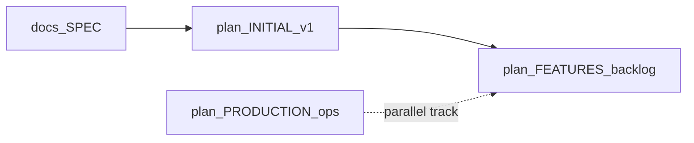

# CodePiece — feature backlog (SPEC gaps and future work)

Single place for **product and UX work** that goes beyond the shipped **v1** checklist in **[`INITIAL.md`](INITIAL.md)**. It maps **[`docs/SPEC.md`](../docs/SPEC.md)** to the current codebase: what is **missing**, **partial**, or **deferred on purpose**.

**How this fits**

- **[`docs/SPEC.md`](../docs/SPEC.md)** — long-term intent and mechanics (broader than v1).
- **[`INITIAL.md`](INITIAL.md)** — **v1 execution contract** (what was built for the hackathon slice).
- **This file** — backlog for **post-v1** and **SPEC-shaped** work that is not yet implemented.
- **[`PRODUCTION.md`](PRODUCTION.md)** — **deploy / ops** (image, Compose, CI), not user-facing features.

When **SPEC** and **INITIAL** disagree, **INITIAL + [`docs/GUARDRAILS.md`](../docs/GUARDRAILS.md)** still govern **what ships in v1**. Use **FEATURES** to queue **next** work; update this doc when you commit to a scope.

## From SPEC — not implemented or only partial

### Matching (owners / committers)

- **SPEC:** “Match users with code owners / committers” for learning or collaboration.
- **Now:** **Explicitly out of v1** in [`INITIAL.md`](INITIAL.md) — no OAuth, no contact flows.
- **Backlog:** Future **epic** only: opt-in identity, consent, channels that satisfy **[`docs/GUARDRAILS.md`](../docs/GUARDRAILS.md)** (privacy, no unsolicited contact). No implementation until there is an explicit product decision.

### Learning feedback loop (history, what was seen / liked)

- **SPEC:** Store history of viewed code; track likes, dislikes, and what was already seen.
- **Now:** Every **like/skip** is stored in **`swipes`**; **[`pickNextCard`](../src/lib/feed.ts)** excludes cards the user has already **swiped** (`notInArray` on swipe `card_id`s). There is **no** impression-only “seen without swipe” table, **no** history or “your likes” UI, **no** export of a learning trail.
- **Backlog:** Optional **`user_card_seen`** (or analytics events) if you need feed logic without a final swipe; UI for **session history** or **saved likes**; teaching aids (e.g. “why this snippet”) tied to GUARDRAILS.

### Internal rating system (“good” / popular code)

- **SPEC:** System to judge which code is good, popular, or valuable.
- **Now:** Next card order is **`RANDOM()`** in SQLite ([`feed.ts`](../src/lib/feed.ts)); swipe counts are **not** aggregated for ranking or display.
- **Backlog:** Aggregates from **`swipes`** (per **Card**, not per developer — see GUARDRAILS: **no “best developers” leaderboard**); spam / novelty guards; optional **ranked** or **weighted** feed once metrics exist.

### Discovery (“attractive or high-quality” surfacing)

- **SPEC:** Surface attractive or high-quality code.
- **Now:** “Quality” is mostly **ingestion** heuristics (size limits, JSDoc/heuristic context, path filters) — not a scored feed.
- **Backlog:** Connect discovery to **internal ratings** and safer ranking when that layer exists.

### Snippet memo (600-character personal note per card)

- **SPEC:** Users can leave an optional **memo** on a snippet — max **600 characters**, private-by-default for **(user, card)**.
- **Now:** **Not implemented** — only likes/skips are stored; no memo text.
- **Backlog / implementation sketch:**
  - **Storage:** e.g. table **`snippet_memos`** with **`user_id`**, **`card_id`**, **`body`** (capped string), **`updated_at`**; unique **`(user_id, card_id)`** with upsert semantics (replace memo on edit).
  - **Validation:** reject **`body`** over **600** Unicode code points (or documented equivalent); trim whitespace; empty string = delete memo.
  - **API:** e.g. **`GET`** memo for current user + card (optional), **`PUT`/`PATCH`** to set or clear; same session/cookie model as swipes.
  - **UI:** Small control on the card (expandable field or modal) with live **character count** (`n/600`); plain text only.
  - **GUARDRAILS:** Treat memo as **untrusted text** — no HTML rendering; escape or strip; optional rate limits per user (see **[`docs/GUARDRAILS.md`](../docs/GUARDRAILS.md)**).

## From INITIAL — optional / later (implementation polish)

These were listed under **“Optional / later (not blocking v1)”** in [`INITIAL.md`](INITIAL.md); details stay here so **FEATURES** is the **single backlog index**.

- **`.tsx`** ingestion (JSX noise vs `.ts`-only v1).
- **Display name** on **`POST /api/users`** surfaced in the **UI** (API may already accept it).
- Formal **Drizzle migration** artifacts beyond runtime **`INIT_SQL`** in [`src/db/init-sql.ts`](../src/db/init-sql.ts).
- **Keyboard** shortcuts for like / skip (accessibility / power users).

## Platform / ops (not product features)

Production **Dockerfile**, **`compose.prod.yml`**, **CI** image push, **scan job** pattern, backups — tracked in **[`PRODUCTION.md`](PRODUCTION.md)**. Do not mix that checklist with user-facing **FEATURES** above; link both from **[`README.md`](../README.md)** when documenting releases.

## Shipped UX (swipe card)

- **`user-select: none`** on the draggable card so pointer-drag does not highlight text (copy is intentional via control only).
- **Copy** next to the context summary copies **`snippet_text`** to the clipboard ([`app/swipe-client.tsx`](../app/swipe-client.tsx) — `CopySnippetButton`, Clipboard API + `execCommand` fallback).

## See also

- [`docs/SPEC.md`](../docs/SPEC.md) — product goals and mechanics  
- [`docs/GUARDRAILS.md`](../docs/GUARDRAILS.md) — constraints (especially social, ratings, attribution)  
- [`INITIAL.md`](INITIAL.md) — v1 scope and **implementation status**  
- [`PRODUCTION.md`](PRODUCTION.md) — production Compose rollout  
- [`docs/TECHNICAL.md`](../docs/TECHNICAL.md) — stack, DB, ingestion  
- [`docs/AGENTS.md`](../docs/AGENTS.md) — read order for implementers  
