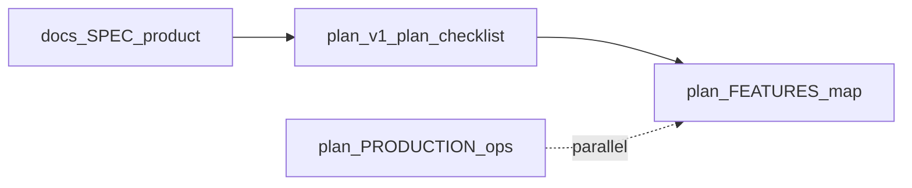

# CodePiece — implementation map and backlog

**[`docs/SPEC.md`](../docs/SPEC.md)** is the **high-level product spec** (intent and mechanics only). **This file** ties that spec to **this repository**: what is **implemented**, what is **only partially** there, and what is **not built** or deferred. Execution checklist and agent order live in **[`v1-plan.md`](v1-plan.md)**; deploy and ops in **[`PRODUCTION.md`](PRODUCTION.md)**.

## Implemented in this repository

Mapped to **[`docs/SPEC.md`](../docs/SPEC.md)** sections where relevant.

**Interaction (swipe)** — Like and skip are persisted per user (`POST /api/swipes`, **`swipes`** table). Next card (`GET /api/cards/next`) excludes cards the user has already swiped ([`src/lib/feed.ts`](../src/lib/feed.ts) — `pickNextCard`, `notInArray` on prior swipe `card_id`s). Anonymous session users (`POST /api/users`, cookie). Card stack UI: pointer drag plus Skip/Like buttons ([`app/swipe-client.tsx`](../app/swipe-client.tsx)); **`user-select: none`** on the card so drag does not select text; copy is explicit via control only.

**Snippet memo** — Optional private note per **(user, card)**, max **600** Unicode code points: table **`snippet_memos`** ([`src/db/schema.ts`](../src/db/schema.ts), [`src/db/init-sql.ts`](../src/db/init-sql.ts)); **`PUT /api/cards/memo`** ([`app/api/cards/memo/route.ts`](../app/api/cards/memo/route.ts)); **`memo`** on **`GET /api/cards/next`**; validation [`src/lib/memo.ts`](../src/lib/memo.ts); [`getMemoBody` / `setMemoBody`](../src/lib/feed.ts) in feed. UI: copy icon then memo icon on the title row → popover with textarea, **`n/600`**, Save; popover excluded from swipe capture ([`app/swipe-client.tsx`](../app/swipe-client.tsx)).

**Copy snippet** — Title-row control copies **`snippet_text`** (`CopySnippetButton`, Clipboard API + `execCommand` fallback).

**Session stats and personal rankings** — **[`GET /api/dashboard/stats`](../app/api/dashboard/stats/route.ts)** returns session-scoped aggregates from SQLite ([`src/lib/dashboard-stats.ts`](../src/lib/dashboard-stats.ts)): your likes, skips, memos, count of cards with a memo, **topByLikes** (your per-card like counts), and global **cards** row count (“snippets in deck”). Header **Stats** opens a slide-over panel ([`app/app-shell.tsx`](../app/app-shell.tsx)); optional **Library** sidebar in [`app/swipe-client.tsx`](../app/swipe-client.tsx) shows a compact top-by-likes preview. After a **like**, stats refetch; the row for that card is **highlighted** and order may update (no CSS motion animations). Rows: symbol, `repo_label`, path only — no author leaderboard ([`docs/GUARDRAILS.md`](../docs/GUARDRAILS.md)).

**Feed ordering** — Next card selection still uses **`RANDOM()`** in [`feed.ts`](../src/lib/feed.ts); dashboard stats do **not** bias **`pickNextCard`**.

**Theme** — [`app/theme-picker.tsx`](../app/theme-picker.tsx) in the app chrome ([`app/app-shell.tsx`](../app/app-shell.tsx)).

**Ingestion and cards** — Local **`bun run scan`** writes **`cards`**; Next.js reads them only. Heuristics for size, context, path filters per [`docs/TECHNICAL.md`](../docs/TECHNICAL.md).

## Partial relative to the product spec

These areas match the **spirit** of the spec only in part; details above are authoritative for this repo.

- **Internal rating (SPEC §5)** — You get **personal** aggregates and a ranked list of **your** likes, not a global “good code” or popularity system, and not feed ranking from ratings.
- **Learning feedback loop (SPEC §4)** — Likes, skips, and “already swiped” are tracked; there is **no** impression-only “seen without swipe” store, **no** dedicated history or export of a learning trail.
- **Discovery (SPEC §1)** — “Quality” is mostly **ingestion** heuristics, not a scored or ranked discovery feed.

## Not implemented or deferred

### Matching (owners / committers)

- **SPEC:** Match users with code owners or committers for learning or collaboration.
- **Status:** Out of scope for this hackathon slice — no OAuth, no contact flows ([`v1-plan.md`](v1-plan.md)).
- **Backlog:** Future epic only: opt-in identity, consent, channels per **[`docs/GUARDRAILS.md`](../docs/GUARDRAILS.md)**.

### Learning loop — remaining gaps

- Optional **`user_card_seen`** (or analytics) if feed logic needs impressions without a final swipe.
- UI for **session history**, **saved likes** browse, or **export** of a trail.
- Teaching aids (e.g. “why this snippet”) aligned with GUARDRAILS.

### Internal rating — remaining gaps

- Spam / novelty guards; **score-biased** feed if product explicitly opts in; richer history UI.

### Discovery — remaining gaps

- Connect surfacing to internal ratings and safer global ranking when that layer exists.

### Snippet memo — optional follow-ups

- Rate limits; “all my memos” listing; stricter grapheme-cluster length for emoji if needed.

## Optional polish (not blocking ship)

Indexed here as the single backlog list; [`v1-plan.md`](v1-plan.md) **Implementation status** points to **FEATURES** for these items.

- **`.tsx`** ingestion when JSX noise is acceptable to handle.
- **Display name** from **`POST /api/users`** shown in the UI.
- Formal **Drizzle migration** artifacts beyond runtime **`INIT_SQL`** ([`src/db/init-sql.ts`](../src/db/init-sql.ts)).
- **Keyboard** shortcuts for like / skip.

## Platform / ops (not product features)

Production **Dockerfile**, **`compose.prod.yml`**, **CI** image push, **scan job** pattern, backups — **[`PRODUCTION.md`](PRODUCTION.md)**. Keep that separate from user-facing items above.

## See also

- [`docs/SPEC.md`](../docs/SPEC.md) — product goals and mechanics (high level)  
- [`docs/GUARDRAILS.md`](../docs/GUARDRAILS.md) — constraints (social, ratings, attribution)  
- [`v1-plan.md`](v1-plan.md) — execution checklist and implementation status  
- [`PRODUCTION.md`](PRODUCTION.md) — production Compose rollout  
- [`docs/TECHNICAL.md`](../docs/TECHNICAL.md) — stack, DB, ingestion  
- [`docs/AGENTS.md`](../docs/AGENTS.md) — read order for implementers  
