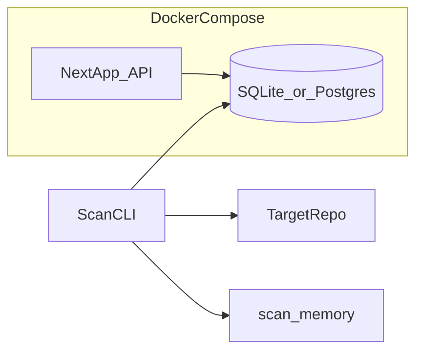

# CodePiece v1 — agent implementation plan

Pre-review roadmap for implementers and coding agents. Follow **[`docs/technical.md`](../docs/technical.md)** for stack choices; align product behavior with **[`docs/SPEC.md`](../docs/SPEC.md)** and **[`docs/GUARDRAILS.md`](../docs/GUARDRAILS.md)**.

## Purpose and constraints

**In scope (v1)**

- Swipe UX (like / skip) with persistence.
- Users, swipes, and “seen” cards in a simple relational store.
- TypeScript-only ingestion pipeline and scan memory.
- Docker Compose to run the app stack locally.

**Explicitly defer**

- **Any OAuth** (Google, GitHub, etc.) — v1 uses anonymous/session users only.
- Matching users to owners/committers, messaging, or contact flows.
- Parsers for languages other than TypeScript.
- ML ranking or distributed job queues (see technical “not in v1”).

## Target architecture

- **Next.js** hosts the UI and **Route Handlers** (or `/api/*`) so authoritative logic stays server-side ([`docs/technical.md`](../docs/technical.md)).
- **Scanner** is a **Bun** CLI run **locally** against a **filesystem path** to a cloned repo (same machine as development). Invoke with `bun run scan` (or a one-off compose run with the repo path **mounted**). No remote ingestion service.
- **Scan memory** (JSON file or DB rows): deterministic keys (`repoId`, path, `contentHash` or commit SHA) for **processed** vs **skipped** + reason, for idempotent runs.

## Data model (minimal)

Implement with one ORM/query layer (Drizzle, Prisma, or Kysely — pick one; **SQLite** default).

| Entity | Fields (conceptual) |
|--------|---------------------|
| **User** | `id`, optional display label, `created_at` — **no OAuth**; no verified external identity in v1 |
| **Card** | Stable `id`; `source_path`; `symbol_name`; `snippet_text`; `line_start` / `line_end`; `context_summary` (JSDoc first line or machine-labeled heuristic); **provenance** per GUARDRAILS: `repo_url` or `repo_label`, `license` (string / SPDX when known), optional `commit_sha` |
| **Swipe** | `user_id`, `card_id`, `action` (`like` \| `skip`), `created_at` |
| **Seen / feed** | Either derive “seen” from swipes only, or add a `user_card_seen` table if you need impressions without a final swipe — **next-card** must exclude already shown for that user ([`docs/SPEC.md`](../docs/SPEC.md)) |

## Ingestion pipeline (TypeScript v1)

1. Walk the target repo tree from a **local path** (env e.g. **`TARGET_REPO`**), i.e. a clone on disk next to or anywhere on the developer machine — **not** fetched over the network by the scanner.
2. **Exclude** `node_modules`, `dist`, `build`, `.git`, and obvious generated paths/patterns (`*.generated.ts`, etc.).
3. Parse **`.ts` first**; defer **`.tsx`** to a follow-up if JSX adds noise ([`docs/technical.md`](../docs/technical.md)).
4. Use **TypeScript compiler API** or **ts-morph** to collect **functions** and **methods** with body **under ~200 lines**; skip oversize symbols; on parse failure, record skip reason in scan memory.
5. **Context**: prefer JSDoc or first line of a leading block comment; otherwise a short heuristic from name + signature, stored with a flag or prefix so UI can label it as non-author docs.
6. **Idempotency**: use scan memory + content hash so unchanged files are not fully reprocessed every run.

## API surface (minimal)

| Method | Path | Purpose |
|--------|------|--------|
| `POST` | `/api/users` | Lazy-create anonymous user (cookie/session); optional display name only — **no OAuth** |
| `GET` | `/api/cards/next` | Query param `userId` (or session); returns next unseen **Card** or empty |
| `POST` | `/api/swipes` | JSON: `cardId`, `action` (`like` \| `skip`); associates with current user |

Cookie or opaque session id for `userId` is enough for v1. No third-party auth tokens.

## UI work

- Single **Next.js** page: monospace **code** block, **context** line, **attribution** footer (repo, license, path) per [`docs/GUARDRAILS.md`](../docs/GUARDRAILS.md).
- **Swipe**: pointer/touch gestures plus **left/right buttons** for accessibility.
- On swipe success, fetch **next** card from the API.

## Docker and local run

- **`docker-compose.yml`**: primarily **`web`** (Next.js + DB). Mount volumes for SQLite (if used) and **`scan_memory`** if the scanner writes inside the project tree.
- **Flow A**: `docker compose up` — use the app in the browser.
- **Flow B**: run **`bun run scan`** on the **host** with `TARGET_REPO` pointing at your **local clone** (simplest). Alternatively mount that clone into a one-off scanner container. Scanning stays **local**; no OAuth or cloud scanner.

## Runtime: Bun vs Next

Prefer **Bun** for the scanner CLI and any standalone scripts ([`docs/technical.md`](../docs/technical.md)). If **Next.js** fails to build or run reliably under Bun in the container, use **Node** only for the Next.js build/dev stage; do not block the hackathon on toolchain edge cases.

## Agent execution order (checklist)

1. **Scaffold** the repo: `package.json`, `tsconfig`, flat `src/` (or minimal `apps/web` only if you split later — prefer flat if it stays simpler).
2. **Database**: schema + migrations; wire SQLite (or Postgres if compose uses a DB service).
3. **Scanner CLI** + **scan memory** read/write.
4. **Ingest**: run scanner locally against `TARGET_REPO` (path to a clone on disk; document an example).
5. **API** routes for users, next card, swipes; verify with **curl** or a tiny test script.
6. **Next.js** page: card display + swipe + API integration.
7. **`Dockerfile`** + **`docker-compose.yml`** + short **Quick start** in [`README.md`](../README.md).

## See also

- [`docs/SPEC.md`](../docs/SPEC.md) — product goals and mechanics  
- [`docs/GUARDRAILS.md`](../docs/GUARDRAILS.md) — license, privacy, UX limits  
- [`docs/technical.md`](../docs/technical.md) — stack and ingestion rules  
