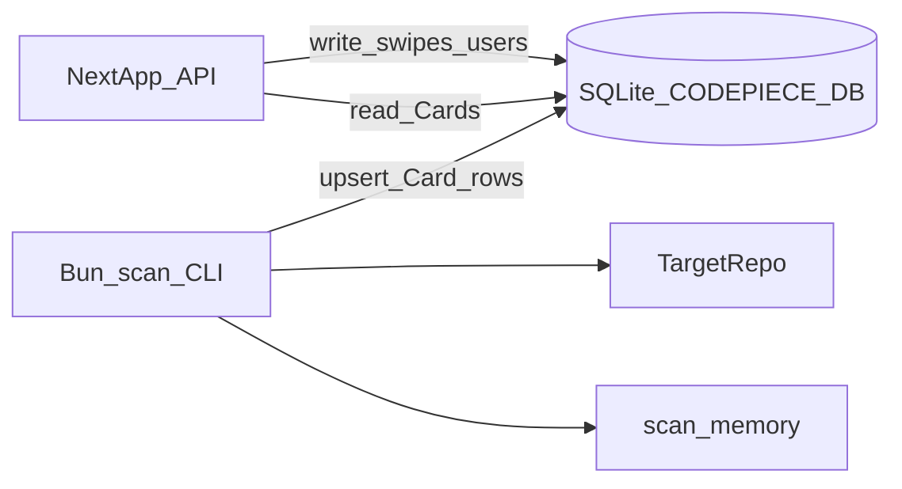

# CodePiece v1 — agent implementation plan

Pre-review roadmap for implementers and coding agents. Follow **[`docs/TECHNICAL.md`](../docs/TECHNICAL.md)** for stack choices; align product behavior with **[`docs/SPEC.md`](../docs/SPEC.md)** and **[`docs/GUARDRAILS.md`](../docs/GUARDRAILS.md)**. **Docker Compose production rollout** lives in **[`PRODUCTION.md`](PRODUCTION.md)**.

## Purpose and constraints

**In scope (v1)**

- Swipe UX (like / skip) with persistence.
- Users, swipes, and “seen” cards in a simple relational store.
- TypeScript-only ingestion: **`bun run scan`** **writes** scan memory and **`Card`** rows to **SQLite** (**`CODEPIECE_DB`**, Bun **`bun:sqlite`** / Next **`better-sqlite3`** on the same file); the **Next.js** app **reads** **Cards** for the feed and **writes** **ratings/swipes** (and users) to the **same database** when code is rated.

**Explicitly defer**

- **Any OAuth** (Google, GitHub, etc.) — v1 uses anonymous/session users only.
- Matching users to owners/committers, messaging, or contact flows.
- Parsers for languages other than TypeScript.
- ML ranking or distributed job queues (see technical “not in v1”).
- **Production Docker image + Compose rollout** — tracked in **[`PRODUCTION.md`](PRODUCTION.md)** (dev **`docker compose`** remains in **[`README.md`](../README.md)**).

## Target architecture

- **Next.js** hosts the UI and **Route Handlers** (or `/api/*`). It **reads** **Card** rows from **SQLite** for the feed; it **writes** **swipe/rating** rows (and **User** rows) when the user rates a snippet. It **does not** run the repo scanner or mutate **Card** rows.
- **`bun run scan`** is a **Bun** CLI run **locally** against `TARGET_REPO`. It **writes** to the **same database** as the app (v1: **`CODEPIECE_DB`** SQLite path): (1) **scan memory** (JSON file) and (2) **`Card`** upserts — the **snippet index** for the feed. No remote ingestion service.
- Until a scan has populated **Card** rows, `/api/cards/next` may return empty; document this in the README quick start.

## Data model (minimal)

Implement with one ORM/query layer (**Drizzle** here). **Bun scanner and Next.js must share one SQLite file** via **`CODEPIECE_DB`**.

| Entity | Fields (conceptual) |
|--------|---------------------|
| **User** | `id`, optional display label, `created_at` — **no OAuth**; no verified external identity in v1 |
| **Card** | Stable `id`; `source_path`; `symbol_name`; `snippet_text`; `line_start` / `line_end`; `context_summary` (JSDoc first line or machine-labeled heuristic); **provenance** per GUARDRAILS: `repo_url` or `repo_label`, `license` (string / SPDX when known), optional `commit_sha` |
| **Swipe** | `user_id`, `card_id`, `action` (`like` \| `skip`), `created_at` |
| **Seen / feed** | Either derive “seen” from swipes only, or add a `user_card_seen` table if you need impressions without a final swipe — **next-card** must exclude already shown for that user ([`docs/SPEC.md`](../docs/SPEC.md)) |

## Ingestion pipeline (TypeScript v1)

1. Walk the target repo tree from a **local path** (env e.g. **`TARGET_REPO`**), i.e. a clone on disk next to or anywhere on the developer machine — **not** fetched over the network by the scanner.
2. **Exclude** `node_modules`, `dist`, `build`, `.git`, and obvious generated paths/patterns (`*.generated.ts`, etc.).
3. Parse **`.ts` first**; defer **`.tsx`** to a follow-up if JSX adds noise ([`docs/TECHNICAL.md`](../docs/TECHNICAL.md)).
4. Use **TypeScript compiler API** or **ts-morph** to collect **functions** and **methods** with body **under ~200 lines**; skip oversize symbols; on parse failure, record skip reason in scan memory.
5. **Context**: prefer JSDoc or first line of a leading block comment; otherwise a short heuristic from name + signature, stored with a flag or prefix so UI can label it as non-author docs.
6. **Idempotency**: use scan memory + content hash so unchanged files are not fully reprocessed every run.
7. **Persist cards**: for each accepted symbol, **upsert** a **Card** row into **SQLite** via **`CODEPIECE_DB`** (snippet text, path, lines, context, provenance). This **fills the feed index**; Next.js **selects** from these rows only.

## API surface (minimal)

| Method | Path | Purpose |
|--------|------|--------|
| `POST` | `/api/users` | Lazy-create anonymous user (cookie/session); optional display name only — **no OAuth** |
| `GET` | `/api/cards/next` | Query param `userId` (or session); returns next unseen **Card** or empty |
| `POST` | `/api/swipes` | JSON: `cardId`, `action` (`like` \| `skip`); **persists** the rating/swipe row in the DB for the current user |

Cookie or opaque session id for `userId` is enough for v1. No third-party auth tokens. **Every swipe must be stored** so the feed and feedback loop stay consistent with [`docs/SPEC.md`](../docs/SPEC.md).

## UI work

- Single **Next.js** page: monospace **code** block, **context** line, **attribution** footer (repo, license, path) per [`docs/GUARDRAILS.md`](../docs/GUARDRAILS.md).
- **Swipe**: pointer/touch gestures plus **left/right buttons** for accessibility.
- On swipe success, fetch **next** card from the API.

## Runtime: Bun vs Next

Prefer **Bun** for the scanner CLI and any standalone scripts ([`docs/TECHNICAL.md`](../docs/TECHNICAL.md)). **Next.js** dev/build/start run via **Node** through **`bun run`**; do not block the hackathon on toolchain edge cases.

## Agent execution order (checklist)

1. **Scaffold** the repo: `package.json`, `tsconfig`, flat `src/` (or minimal `apps/web` only if you split later — prefer flat if it stays simpler).
2. **Database**: schema + migrations; **SQLite** file — single **`CODEPIECE_DB`** for scanner (Bun) and Next (Node).
3. **Scanner CLI** (`bun run scan`): **scan memory** + **Card** upserts (Bun **writes** cards only).
4. **Ingest**: run scanner locally against `TARGET_REPO` — start with **[`samples/mini-algorithms/`](../samples/mini-algorithms/)**, then optionally **[Lugriz/typescript-algorithms](https://github.com/Lugriz/typescript-algorithms)** (see [`samples/README.md`](../samples/README.md)); confirm **Card** count increases and `/api/cards/next` returns data.
5. **API** routes: user lazy-create, next card, **`POST /api/swipes`** **persisting** ratings to the DB; verify with **curl** or a tiny test script.
6. **Next.js** page: card display + swipe + API integration (swipe calls API so ratings are stored).

## Implementation status (v1 features)

Items **1–6** are implemented: scaffold, **Drizzle** + **SQLite** on **`CODEPIECE_DB`** (**`bun:sqlite`** / **`better-sqlite3`**), scanner CLI (memory + card upserts), ingest against **`TARGET_REPO`**, API routes (`/api/users`, `/api/cards/next`, `/api/swipes`), Next.js swipe UI (**pointer drag** + **Skip/Like** buttons, **attribution** footer incl. optional **short commit SHA**, **heuristic** context called out per ingestion rules). **`bun run seed:samples`** loads demo cards. **Package manager:** **Bun** only. **Automated checks:** `bun test` and `bun run build` (see [`docs/TEST-SPEC.md`](../docs/TEST-SPEC.md)).

**Optional / later (not blocking v1):** **`.tsx`** ingestion; **display name** field on **`POST /api/users`** in the UI; formal **Drizzle migration** files beyond runtime **`INIT_SQL`**; **keyboard** shortcuts for like/skip.

**Dev Compose** (bind-mounted **`docker-compose.yml`**) and **README** Docker notes are for local use only. **Production Compose + image + rollout** are **not** done yet — see **[`PRODUCTION.md`](PRODUCTION.md)**.

## See also

- [`docs/SPEC.md`](../docs/SPEC.md) — product goals and mechanics  
- [`docs/GUARDRAILS.md`](../docs/GUARDRAILS.md) — license, privacy, UX limits  
- [`docs/TECHNICAL.md`](../docs/TECHNICAL.md) — stack and ingestion rules  
- **[`PRODUCTION.md`](PRODUCTION.md)** — Docker Compose production rollout roadmap  
